# born to be root 🐧

my notes on how i survived this project. debian, virtualbox, mandatory only, no bonus. if it boots, it ships.


## 0. what i used

- virtualbox + debian netinst iso (amd64)
- vm named `malsabah42`, 2gb ram, 2 cpu, **20gb fixed disk** (fixed so the hash stays stable, 20gb because the whole system fits with room for logs and i can still duplicate/hash it fast)
- hostname `malsabah42`, user `malsabah`
- ova i started from: https://drive.google.com/file/d/15najeg0HZuJo8OQYMoMlu5zakKXUsrdZ/view?usp=sharing

## 1. creating the vm

new vm, pick the iso, skip unattended install, give it ram and cpu, 20gb fixed vdi. thats it.

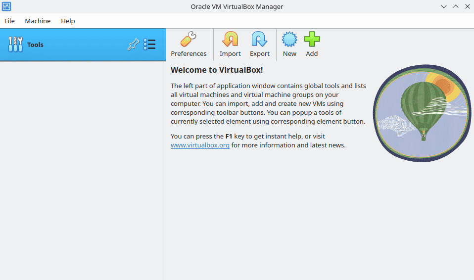

## 2. installing debian

boot, hit install, hostname `malsabah42`, skip domain, set root + user passwords (make them strong now, the policy will yell at you later otherwise).

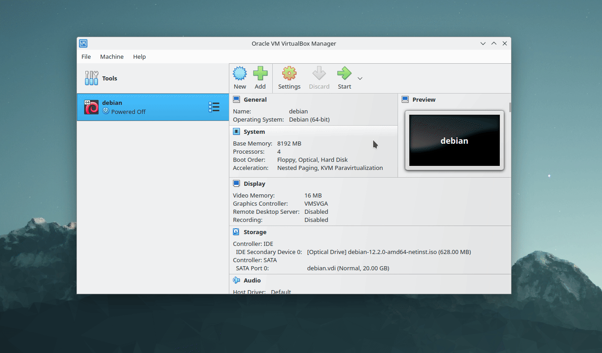

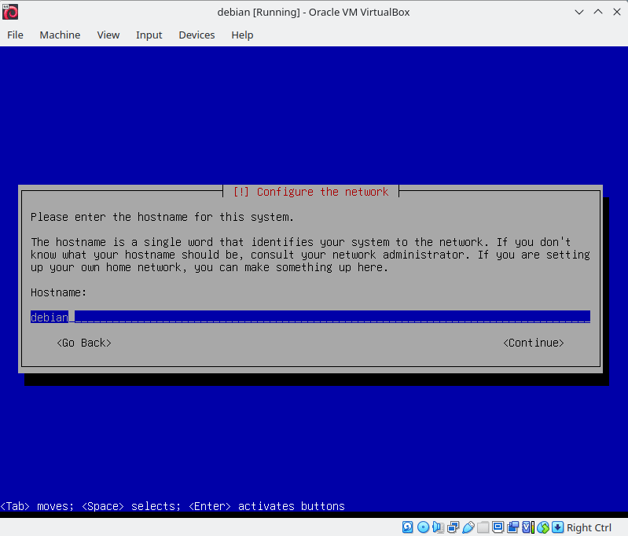

### partitioning (the scary part)

i went with encrypted lvm: efi 512mb, /boot ~1gb outside encryption, rest encrypted. inside lvm: swap 2gb, `/` 4gb, `/var` 3gb, `/var/log` 2gb (so logs never kill root), `/home` 3gb, `/srv` 3gb spare, `/tmp` 1gb, leftover free for snapshots. at least 2 encrypted partitions = covered since everything sits on luks.

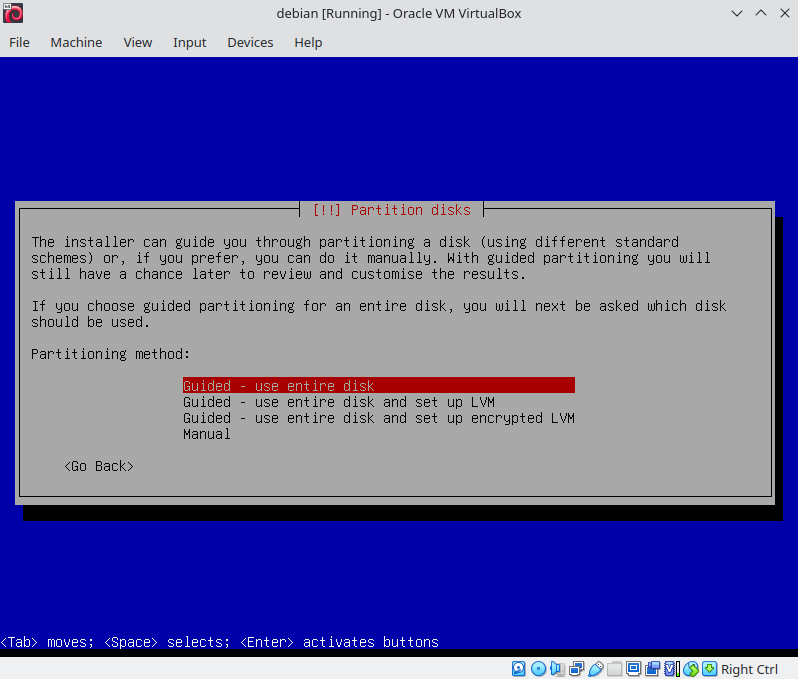

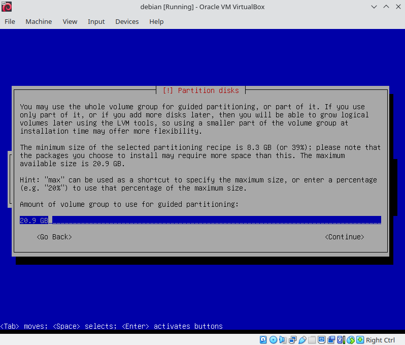

software selection: **only ssh server + standard utilities**. uncheck everything desktop. if gnome shows up you messed up.

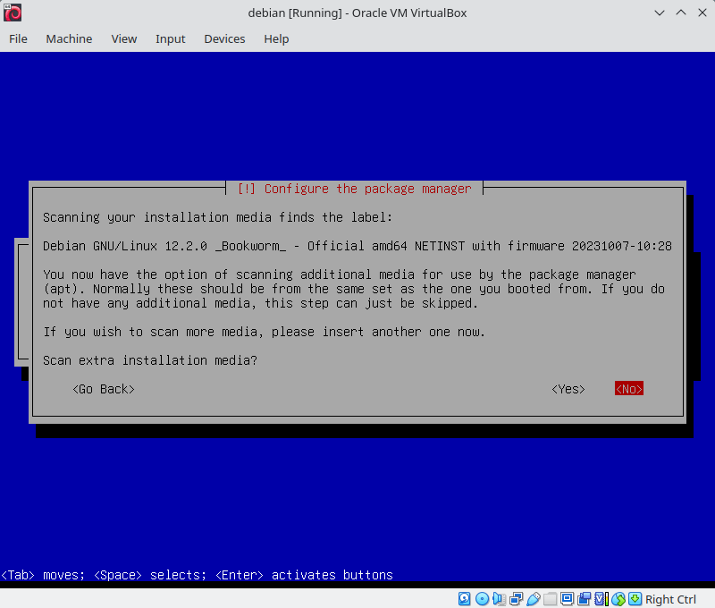

## 3. ssh on port 4242

login as root, open `/etc/ssh/sshd_config`, set `Port 4242` and `PermitRootLogin no`, restart ssh. then port-forward host 4242 -> guest 4242 in virtualbox network settings so i can `ssh -p 4242 malsabah@localhost` from my own terminal.

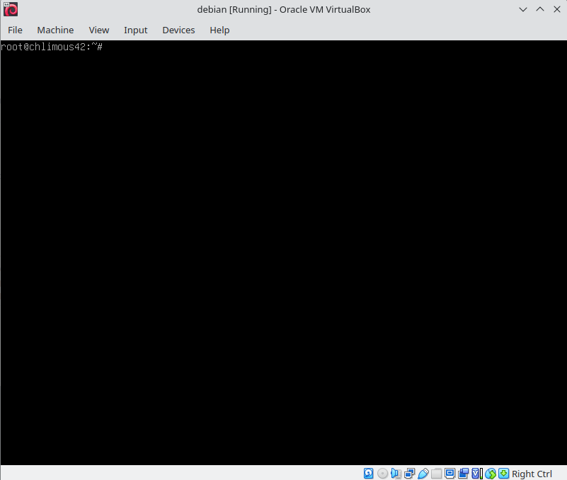

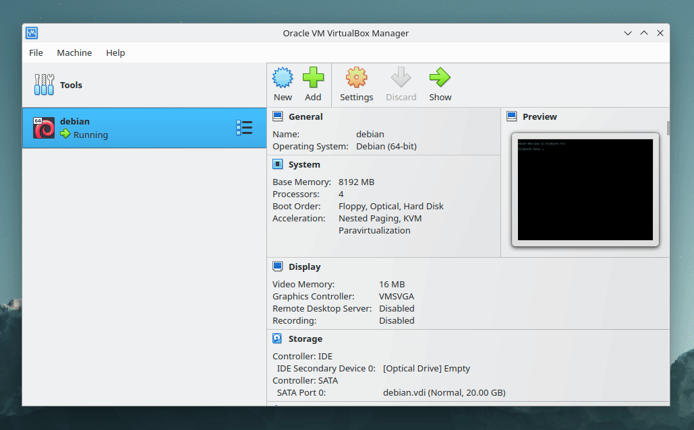

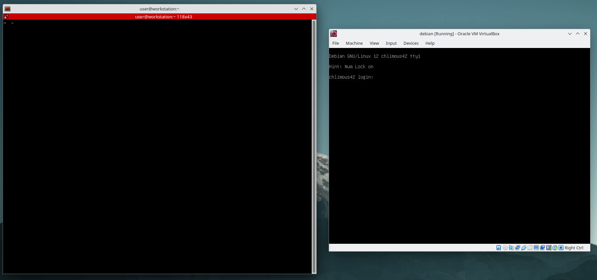

## 4. firewall (ufw, one port open)

```bash
apt install ufw
ufw default deny incoming
ufw default allow outgoing
ufw allow 4242
ufw enable
ufw status numbered
```

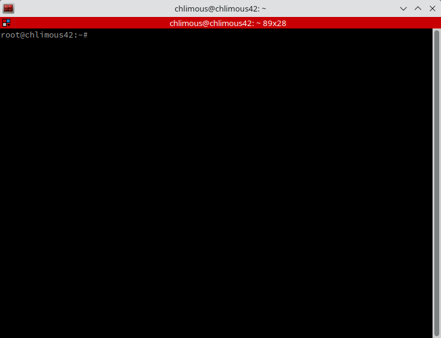

## 5. sudo + groups

```bash
apt install sudo
visudo
```

threw this in:

```text
Defaults secure_path="/usr/local/sbin:/usr/local/bin:/usr/sbin:/usr/bin:/sbin:/bin"
Defaults requiretty
Defaults badpass_message="nope. wrong password."
Defaults logfile="/var/log/sudo/sudo.log"
Defaults log_input
Defaults log_output
Defaults iolog_dir=/var/log/sudo
Defaults passwd_tries=3
```

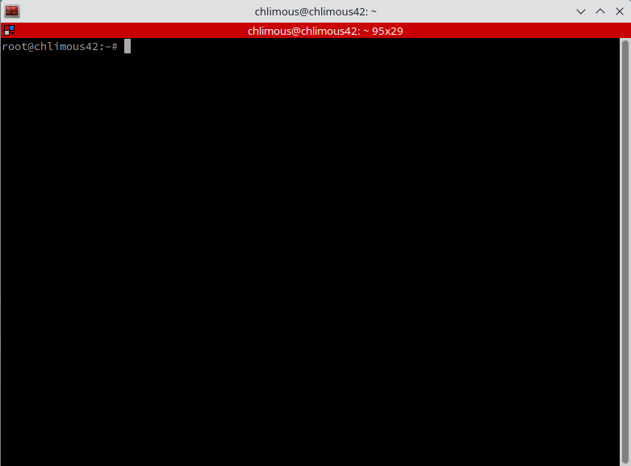

then the groups:

```bash
groupadd user42
usermod -a -G user42,sudo malsabah
cat /etc/group
```

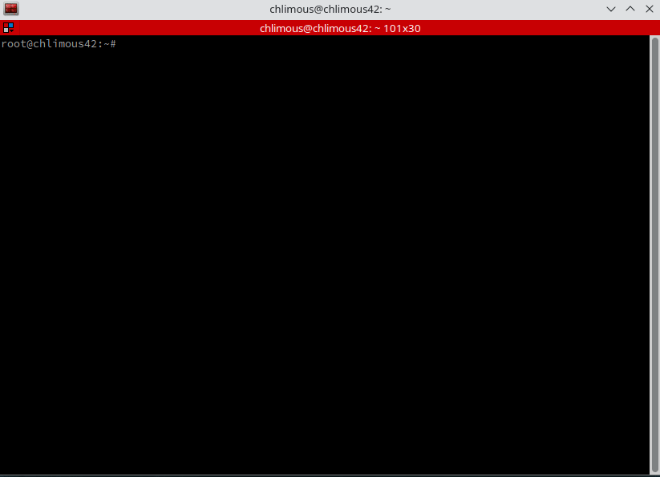

## 6. password policy (pain section)

in `/etc/login.defs`: expiry 30 days, min 2 days between changes, warn 7 days. applied it with `chage -M 30` / `chage -m 2` on my user + root.

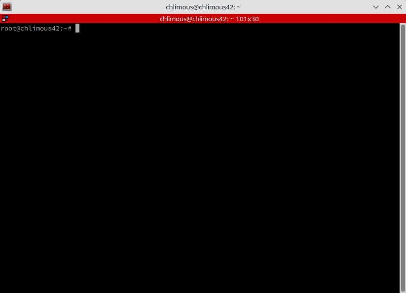

then pwquality for the strong stuff (`apt install libpam-pwquality`), in `/etc/pam.d/common-password`:

```text
password requisite pam_pwquality.so retry=3 minlen=10 difok=7 maxrepeat=3 dcredit=-1 ucredit=-1 lcredit=-1 reject_username enforce_for_root
```

translation: 10+ chars, upper + lower + digit, max 3 same chars in a row, no username in it, 7 chars different from old password. then `passwd malsabah` + `passwd root` again and suffer.

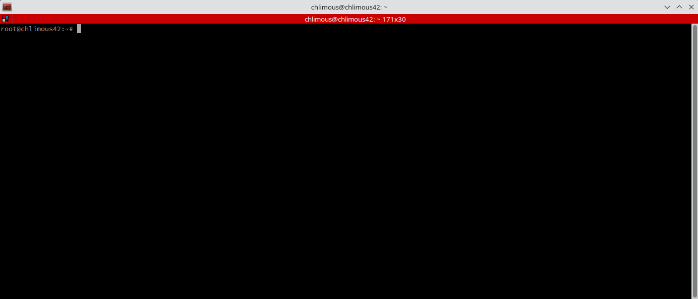

## 7. monitoring script + cron

my script prints the 11 required lines (arch, cpu, ram, disk, load, boot, lvm, tcp, users, ip/mac, sudo count) and pipes to `wall`. cron runs it at reboot + every 10 min:

```text
@reboot bash /etc/cron.d/monitoring.sh | wall
*/10 * * * * bash /etc/cron.d/monitoring.sh | wall
```

(full script lives in `monitoring.sh` in older commits if you want it.)

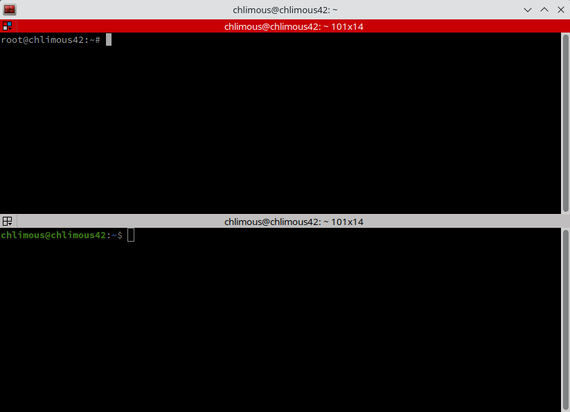

kill it without editing (evaluators love this trick): `sudo pkill -f monitoring.sh`

## 8. signature.txt, the final boss

shutdown the vm, make sure zero snapshots exist, then on the host:

```bash
sha1sum ~/VirtualBox\ VMs/malsabah42/malsabah42.vdi
```

paste that hash into `signature.txt`. boot the vm again and the hash changes, so duplicate the disk for safety.

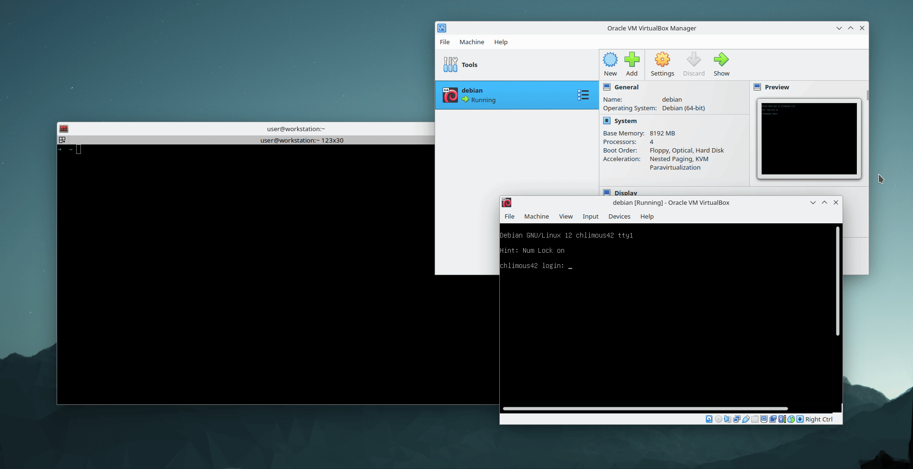

---

thats the whole thing. mandatory done, no bonus, no web server, no extra ports. good luck on defense, know your `apt vs aptitude` and what apparmor does or they will eat you alive.
